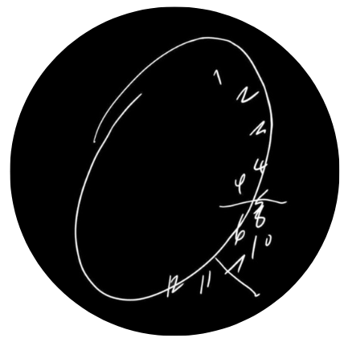

<!-- add header-->

<!-- animação inicial -->

   
  

<!-- add linha -->

<!-- imagem lateral-->

<!-- resumo/apresentação -->

  <h3>Hey,</h3>
  I am an undergraduate student in Information Systems, with an interest in Software Engineering and a passion for Computer Science, creating digital solutions through coding, design, and critical thinking.   
  When I’m not studying, you’ll find me expanding my horizons — whether through books or movies — but always open to new perspectives.
  

 
 

<!-- add linha -->

<!-- conexões -->

  
   
  <!--add link do github -->
  
  &nbsp;
  <!--add link do linkedIn -->
  
  &nbsp;
  <!--add link para o e-mail -->
  
  &nbsp;
  <!-- add link para o lattes -->
  <a href="http://lattes.cnpq.br/1950946818717842">
  
  &nbsp;
  <!-- add link do discord -->
  <a href="https://discord.com/users/anaclarays">
  

 
 

<!-- add linha -->

  
   

  <table align="center" style="background: transparent; border: none;">
    <tr>
      <td align="right" valign="middle" style="padding-right: 20px;">
        <strong>Frontend</strong>
      </td>
      <td align="left" valign="middle">
        
        
        
        
        
      </td>
    </tr>
    <tr>
      <td align="right" valign="middle" style="padding-right: 20px;">
        <strong>Backend & Database</strong>
      </td>
      <td align="left" valign="middle">
        
        
        
        
        
        
      </td>
    </tr>
    <tr>
      <td align="right" valign="middle" style="padding-right: 20px;">
        <strong>Tools</strong>
      </td>
      <td align="left" valign="middle">
        
        
        
        
        
      </td>
    </tr>
  </table>

 
